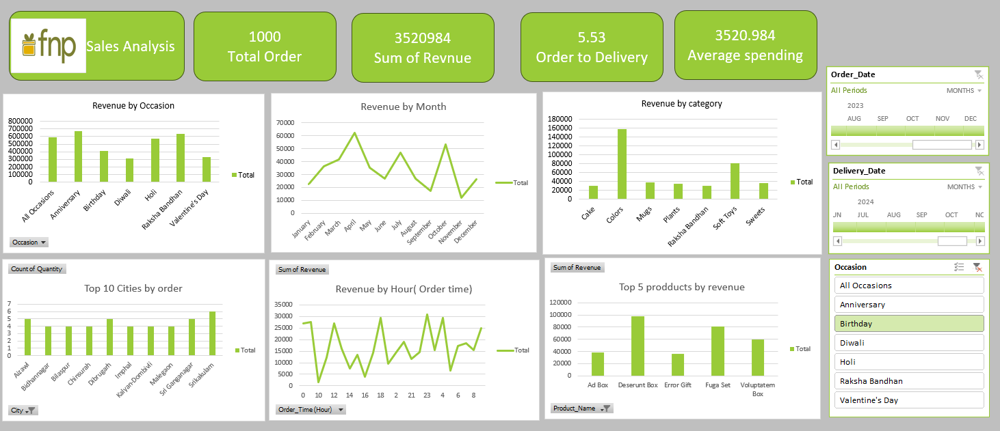

📊 FNP Sales Analysis Dashboard — Excel Project
🔍 Project Overview

Analyzed sales data for Ferns N Petals (FNP), a leading gifting and flowers brand, using Microsoft Excel to uncover business insights related to revenue trends, customer behavior, and product performance.

Built an interactive dashboard to enable stakeholders to monitor KPIs, identify growth opportunities, and make data-driven decisions.

🎯 Business Objective
Evaluate overall sales performance and customer purchasing patterns
Identify high-revenue occasions and seasonal demand trends
Analyze product and city-level performance
Optimize marketing timing and product strategy using data insights
📌 Key Metrics & Business Questions
Total Orders & Total Revenue
Average Order Value (AOV)
Revenue by Occasion (Diwali, Valentine’s Day, etc.)
Monthly Revenue Trends (Seasonality Analysis)
Top Product Categories by Revenue
Top 10 Cities by Order Volume
Peak Order Hours (Customer Behavior Analysis)
Top 5 Products by Revenue Contribution
🛠️ Approach & Methodology

1. Data Preparation

Cleaned ~1,000+ records by removing duplicates and handling missing values
Standardized date-time fields and derived order hour for time-based insights

2. Data Analysis

Built multiple Pivot Tables to aggregate revenue across key dimensions:
Occasion
Month
Product Category
City
Order Time

3. Dashboard Development

Designed an interactive Excel dashboard using:
Pivot Charts
KPI Cards (Revenue, Orders, AOV)
Slicers (Order Date, Delivery Date, Occasion)
Enabled dynamic filtering for quick business exploration
📈 Key Insights
Seasonal spikes observed during major occasions like Valentine’s Day and Raksha Bandhan
Cakes and Colors categories generated the highest revenue share
Evening hours (9 PM – 11 PM) showed peak customer activity
Tier-2 cities contributed significantly to order volume, indicating expansion potential
💡 Business Recommendations
Launch targeted pre-festival marketing campaigns 2–3 weeks before peak occasions
Expand high-performing categories (Cakes, Colors) with bundled offers
Schedule promotions during peak hours (9 PM–11 PM) to maximize conversions
Improve logistics and delivery time in high-demand Tier-2 cities to enhance customer satisfaction
🧰 Tools & Skills Used
Microsoft Excel
Pivot Tables & Pivot Charts
Slicers & Timeline Filters
Data Cleaning & Transformation

